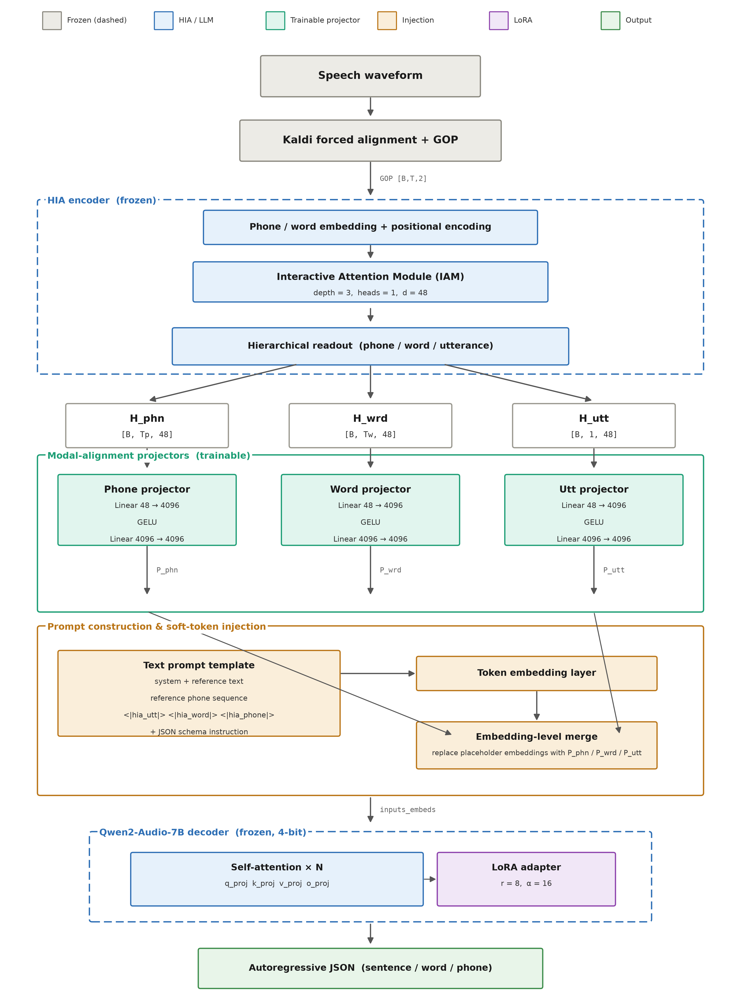
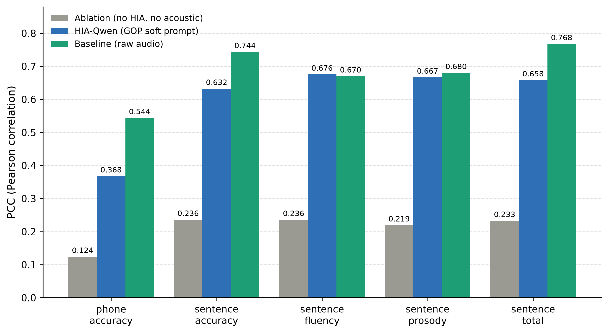

# HIA-Qwen APA Experiment

[](https://www.python.org/)
[](https://pytorch.org/)
[](https://github.com/huggingface/transformers)
[](https://github.com/huggingface/peft)
[](https://github.com/bitsandbytes-foundation/bitsandbytes)
[](https://huggingface.co/Qwen/Qwen2-Audio-7B-Instruct)
[](https://www.openslr.org/101/)
[](LICENSE)

This repository implements a two-stage experiment that fuses the HIA pronunciation-assessment frontend with a Qwen2-Audio language backend through learnable soft prompts.

The experiment does not feed raw audio into Qwen. HIA reads GOP features and phone ids, then its hidden states are projected into Qwen's embedding space and injected as continuous soft tokens.

## Architecture

```text
GOP + phone ids -> frozen HIA -> HIA hidden states
                                -> projector MLPs -> Qwen embedding space
text prompt + HIA soft tokens   -> Qwen2-Audio decoder
                                -> APA scores
```

| Stage | Objective | Trainable | Frozen | Target |
| --- | --- | --- | --- | --- |
| Stage 1 | Alignment pre-training | HIA-to-Qwen projectors | HIA, Qwen2-Audio | `Score: {Score}` sentence total, or full multi-level JSON |
| Stage 2 | Joint LoRA fine-tuning | Projectors + Qwen LoRA (+ optional aux heads) | HIA, Qwen base weights | Multi-level JSON scores |



## HIA Feature Definition

The word-level soft prompt is not the IAM global `H_word [B,1,D]` token. The implementation extracts the HIA Word Branch hidden state:

```text
F_word = word_norm(word_conv((X + phn_residual + H_word).T).T)  # [B,L,D]
```

Then `F_word` is mean-pooled by `word_id` from `label_word[:,:,3]` to produce `[B,T_wrd,D]`, preserving the dynamic number of words per utterance.

Feature streams:

- Phone: valid positions from `F_phn [B,L,D]` -> `[B,T_phn,D]`
- Word: pooled Word Branch `F_word [B,L,D]` -> `[B,T_wrd,D]`
- Utterance: utterance branch `dec_out [B,1,D]`

## Repository Layout

```text
configs/
  alignment_stage1.yaml             # Stage 1, sentence_total target, local paths
  alignment_stage1_multi.yaml       # Stage 1, multi-granularity target
  alignment_stage1_runpod.yaml      # Stage 1, multi-granularity, bundled external/ paths
  joint_lora_stage2.yaml            # Stage 2 baseline
  joint_lora_stage2_multi.yaml      # Stage 2 on top of the multi-granularity Stage 1
  joint_lora_stage2_ablation.yaml   # Stage 2 without HIA soft prompts (use_hia: false)
  joint_lora_stage2_runpod.yaml     # Stage 2, bundled external/ paths
  joint_lora_stage2_aux_runpod.yaml # Stage 2 + auxiliary phone/word regression heads
  eval_stage2.yaml                  # Eval, local paths
  eval_stage2_multi.yaml
  eval_stage2_ablation.yaml
  eval_stage2_runpod.yaml
  eval_stage2_runpod_fast.yaml      # Batched generation (batch_size: 24)
  eval_stage2_aux_runpod.yaml
scripts/
  train_alignment.py                # Stage 1
  train_joint_lora.py               # Stage 2
  evaluate_hia_qwen.py              # Generation + PCC/SCC/RMSE metrics
  make_poster_figures.py            # Figures from metrics.json
  runpod_setup.sh                   # One-shot venv + model download on a CPU pod
src/hia_qwen/
  data.py                           # Stage-1 sentence_total dataset
  stage2_data.py                    # Multi-level JSON dataset (+ use_hia switch)
  hia_features.py                   # Frozen HIA feature extraction
  modeling.py                       # Stage-1 model (projectors only)
  joint_modeling.py                 # Stage-2 model (projectors + LoRA + aux heads)
  schema.py                         # JSON target rendering, parsing, metrics
tests/
  test_stage1_alignment.py
  test_stage2_pipeline.py
external/                           # Bundled, self-contained (~99 MB)
  apa-hia-framework/src/models/     # HIA model code
  hia_ckpt/best_audio_model.pth     # Frozen HIA checkpoint
  seq_data_librispeech/             # GOP features + phone/word/utt labels (.npy)
  so762/                            # train/test multi_all JSONL
  speechocean762/                   # wav.scp per split
figures/                            # Poster figures (PNG/PDF/SVG)
papers/                             # Reference papers
SETUP_RUNPOD.md                     # End-to-end RunPod (network volume) guide
```

## Environment

The system `python3` can run local unit tests only if PyTorch is installed; it cannot import `Qwen2AudioForConditionalGeneration` when its PyTorch is too old for the installed Transformers package:

```text
AttributeError: module 'torch.utils._pytree' has no attribute 'register_pytree_node'
```

Create and use a project venv for full Qwen dry-runs and training:

```bash
cd <repo-root>
python3 -m venv .venv
source .venv/bin/activate
python -m pip install --upgrade pip
python -m pip install -r requirements.txt
```

If a CUDA-specific PyTorch wheel is needed:

```bash
python -m pip install --index-url https://download.pytorch.org/whl/cu121 'torch>=2.2.0'
python -m pip install -r requirements.txt
```

Verify Qwen2-Audio import:

```bash
python -c "from transformers import Qwen2AudioForConditionalGeneration; print('ok')"
```

`huggingface-hub` is pinned to `<1.0`: Transformers `<5` rejects hub 1.x, which also renames the `huggingface-cli` command to `hf`.

For a remote GPU run (RunPod network volume, CPU pod for setup + GPU pod for training), see [SETUP_RUNPOD.md](SETUP_RUNPOD.md). The `*_runpod.yaml` configs resolve all data paths relative to the repo root, so they work from the bundled `external/` directory with no extra downloads beyond the Qwen base model.

## Data Paths

The non-RunPod configs (`alignment_stage1.yaml`, `joint_lora_stage2.yaml`, `eval_stage2.yaml`, ...) still point at absolute paths on the original development machine (`/datas/store163/...`). On any other host, either edit `data.*` / `hia.*` in the config or use the `*_runpod.yaml` variants, which read the bundled `external/` copies.

## Tests

These tests avoid loading Qwen2-Audio and can run without a GPU (PyTorch is still required):

```bash
python3 -m unittest discover tests
```

Expected current result: `11 tests OK`.

## Stage 1: Alignment Pre-training

Stage 1 trains only the projector MLPs. HIA and Qwen2-Audio are frozen (the script hard-fails if any non-projector parameter is trainable or receives a gradient).

`data.task` selects the alignment objective:

- `sentence_total` (default): the legacy single-signal target; projectors only ever receive gradient about the sentence-level total, so the phone/word projectors are never directly supervised.
- `multi_all`: multi-granularity alignment on the full JSON target (sentence + per-word + per-phone scores), which forces the phone/word soft tokens to carry level-specific information.

Dry-run:

```bash
source .venv/bin/activate
python scripts/train_alignment.py --config configs/alignment_stage1.yaml --dry-run --max-steps 2
```

Train:

```bash
python scripts/train_alignment.py --config configs/alignment_stage1.yaml
# multi-granularity variant
python scripts/train_alignment.py --config configs/alignment_stage1_multi.yaml
```

Output (under `output_dir`):

```text
outputs/alignment_stage1/projector.pt
outputs/alignment_stage1/checkpoints/epoch_{N}/   # per-epoch projector snapshots
outputs/alignment_stage1/run_config.json          # config + git hash + start time
outputs/alignment_stage1/train_log.jsonl          # per-step loss and feature lengths
outputs/alignment_stage1/train_summary.json       # elapsed time, steps, epochs
runs/{exp_name}/                                  # TensorBoard scalars
```

`exp_name` defaults to `s1_lr{lr}_ep{epochs}_{timestamp}` and can be overridden with `exp_name` in the config. Dry-runs write nothing.

## Stage 2: Joint LoRA Fine-tuning

Stage 2 trains projectors and Qwen LoRA adapters. HIA remains frozen and Qwen base weights remain frozen. Default LoRA modules are `q_proj`, `k_proj`, `v_proj`, and `o_proj`.

Dry-run:

```bash
python scripts/train_joint_lora.py --config configs/joint_lora_stage2.yaml --dry-run --max-steps 2
```

Train:

```bash
python scripts/train_joint_lora.py --config configs/joint_lora_stage2.yaml
```

Resume from an epoch checkpoint (loads projector + LoRA weights and continues from the next epoch):

```bash
python scripts/train_joint_lora.py --config configs/joint_lora_stage2.yaml \
    --resume-from outputs/joint_lora_stage2/checkpoints/epoch_3
```

Formal Stage-2 training should run after Stage 1 so it can initialize from `outputs/alignment_stage1/projector.pt` (`qwen.projector_checkpoint`); training hard-fails if that path is configured but missing. Stage-2 dry-run can still validate the pipeline with scratch projectors if that file is absent.

Outputs mirror Stage 1 (`run_config.json`, `train_log.jsonl`, `train_summary.json`, `checkpoints/epoch_{N}/`, TensorBoard under `runs/`), with `save_joint` writing both the projectors and the LoRA adapter to `output_dir`.

### Auxiliary phone/word regression heads

Stage 2 can add a multi-task objective on top of the LM loss: linear heads read the projected phone/word soft tokens and regress the gold scores (normalized to `[0,1]`; the word head predicts accuracy, stress and total). This gives the phone/word projectors a direct, level-specific gradient instead of relying only on the decoded JSON.

```yaml
train:
  aux_phone_weight: 1.0   # 0 disables
  aux_word_weight: 1.0
```

Raise the weights if phone/word metrics stay flat; lower them if JSON validity or sentence scores degrade. See `configs/joint_lora_stage2_aux_runpod.yaml`.

### Ablation: LoRA only, no HIA

`configs/joint_lora_stage2_ablation.yaml` sets `data.use_hia: false`, so the prompt carries no `<|hia_*|>` placeholders and HIA features are never injected. Everything else matches the baseline, which isolates the contribution of the HIA soft prompts. Evaluate it with `configs/eval_stage2_ablation.yaml`.

## Stage-2 JSON Schema

Stage 2 outputs valid JSON only:

```json
{
  "sentence": {"accuracy": 8, "fluency": 9, "prosody": 9, "completeness": 10, "total": 8},
  "words": [{"text": "WE", "accuracy": 10, "stress": 10, "total": 10}],
  "phones": [{"phone": "W", "word_index": 0, "index": 0, "accuracy": 10}]
}
```

Scores use the SpeechOcean762 0-10 scale. Word stress remains 5 or 10 in the labels.

## Evaluation

Gold-target smoke test, no Qwen load required:

```bash
python scripts/evaluate_hia_qwen.py --config configs/eval_stage2.yaml --use-targets
```

Expected smoke result: `invalid_count = 0`, all populated RMSE values are `0.0`, and all non-constant populated PCC/SCC values are `1.0`.

Evaluate a trained Stage-2 checkpoint:

```bash
python scripts/evaluate_hia_qwen.py --config configs/eval_stage2.yaml
```

Re-score an existing predictions file without regenerating:

```bash
python scripts/evaluate_hia_qwen.py --config configs/eval_stage2.yaml \
    --predictions outputs/joint_lora_stage2/eval_test/predictions.jsonl
```

Generation is batched and left-padded, with records bucketed by phone count so each batch is uniform length (the longest batch runs first to fail fast on OOM). Raise `eval.batch_size` for speed — `configs/eval_stage2_runpod_fast.yaml` uses `24`, which keeps the KV cache safely under 80 GB.

Evaluation writes:

```text
outputs/joint_lora_stage2/eval_test/predictions.jsonl
outputs/joint_lora_stage2/eval_test/scored_predictions.jsonl
outputs/joint_lora_stage2/eval_test/metrics.json
```

Metrics include PCC, SCC, RMSE, and invalid JSON count.

## Figures

`scripts/make_poster_figures.py` reads PCC values straight from each run's `metrics.json` (falling back to the 3-epoch preliminary numbers when a file is missing) and writes PNG (300 dpi), PDF and SVG into `figures/`:

```bash
python scripts/make_poster_figures.py
```



Note: the baseline metrics path in that script points at the original development machine, so update `BASE_METRICS` before regenerating elsewhere.

## Recommended Workflow

```bash
cd <repo-root>
source .venv/bin/activate

python -m unittest discover tests
python scripts/evaluate_hia_qwen.py --config configs/eval_stage2.yaml --use-targets
python scripts/train_alignment.py --config configs/alignment_stage1.yaml --dry-run --max-steps 2
python scripts/train_alignment.py --config configs/alignment_stage1.yaml
python scripts/train_joint_lora.py --config configs/joint_lora_stage2.yaml --dry-run --max-steps 2
python scripts/train_joint_lora.py --config configs/joint_lora_stage2.yaml
python scripts/evaluate_hia_qwen.py --config configs/eval_stage2.yaml
```

## License

[MIT](LICENSE).
